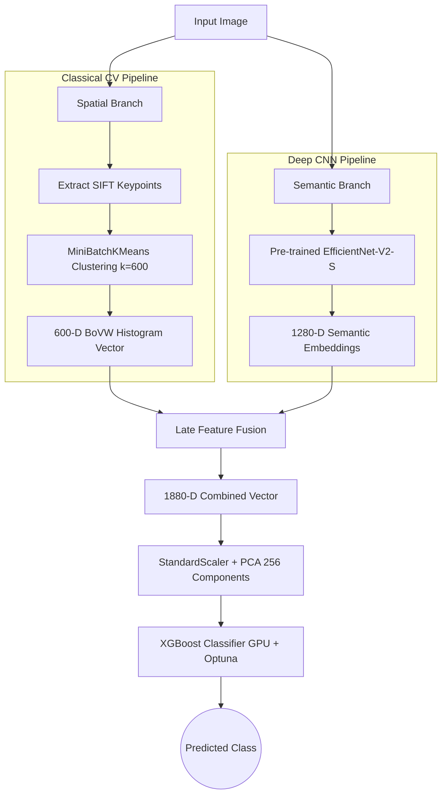

# ImageAnnotationAI (Hybrid SIFT + Deep CNN Image Recognition System)

## 📌 Overview

This project implements a novel **late-fusion architecture** for object recognition, combining hand-crafted spatial features (SIFT) with modern deep learning semantic embeddings (EfficientNet-V2).

It was built to reproduce and significantly extend the benchmark established in the peer-reviewed paper: _"2D object recognition: a comparative analysis of SIFT, SURF and ORB feature descriptors"_ (Bansal et al., 2021). Evaluated on the **Caltech-101 Dataset** (102 classes, 9,000+ images), our hybrid approach achieves **~90% accuracy**, demonstrating a **+4.77% absolute improvement** over the base paper's benchmark.

---

## 🏗️ Technical Architecture

The system utilizes a dual-branch feature extraction pipeline, fusing classical computer vision with deep learning.



---

## ⚙️ Methodology

### 1. Dual-Branch Feature Extraction

- **Spatial Branch (Classical CV):** Implements Scale Invariant Feature Transform (SIFT) to extract local spatial features. We build a Bag of Visual Words (BoVW) representation with 600 visual words using `MiniBatchKMeans` clustering, generating a 600-dimensional histogram feature vector per image.
- **Semantic Branch (Deep Learning):** Deploys a pre-trained `EfficientNet-V2-S` (with ImageNet weights) as a frozen feature extractor. By removing the classification head, we generate 1,280-dimensional deep semantic embeddings per image.

### 2. Feature Fusion & Dimensionality Reduction

- **Late-Fusion:** The spatial (600-D) and semantic (1,280-D) vectors are horizontally stacked to create a combined 1,880-D feature representation.
- **Dimensionality Reduction:** To preserve maximum variance while reducing computational load, the combined vector is normalized (`StandardScaler`) and reduced to 256 components using Principal Component Analysis (PCA).

### 3. Classification & Hyperparameter Optimization

- **Classifier:** We utilize a GPU-accelerated `XGBoost` classifier with a `multi:softprob` objective for multiclass classification.
- **Optimization:** Hyperparameters were autonomously tuned using `Optuna` (Bayesian optimization). The optimal parameters found are:
  - `n_estimators`: 136
  - `max_depth`: 4
  - `learning_rate`: 0.099
  - `subsample`: 0.85
  - `colsample_bytree`: 0.98

---

## 📊 Performance Comparison

All metrics were evaluated using **5-Fold Stratified Cross-Validation** to ensure robust, publication-grade results.

| Metric                        | Our Hybrid System | Base Paper (Bansal et al., 2021) | Improvement   |
| :---------------------------- | :---------------- | :------------------------------- | :------------ |
| **Recognition Accuracy**      | **89.32%**        | 84.55% (SIFT+SURF+ORB + RF)      | **+ 4.77%**   |
| **True Positive Rate (TPR)**  | **0.8536**        | ~0.8460                          | Higher TPR    |
| **False Positive Rate (FPR)** | **0.001080**      | ~0.0010                          | Comparable    |
| **Area Under Curve (AUC)**    | **0.9975**        | ~0.9800                          | Closer to 1.0 |

_Note: The base paper utilized LPP (8 components) for dimensionality reduction and a Random Forest classifier. Our approach upgraded this to PCA (256 components) and an Optuna-tuned XGBoost._

---

## 📈 Visual Results

### Confusion Matrix

The notebook generates a high-resolution 24x24 inch confusion matrix visualizing the model's performance across all 102 classes of the Caltech-101 dataset.

---

## 💻 Technologies & Tools

- **Programming Language:** Python 3.8+
- **Computer Vision:** OpenCV (cv2)
- **Deep Learning:** PyTorch, torchvision
- **Machine Learning:** XGBoost, scikit-learn
- **Optimization:** Optuna
- **Data Processing:** NumPy, Pandas, tqdm
- **Dataset Management:** Kagglehub

---

## 🚀 Quick Start

1. **Install Dependencies:**

   ```bash
   pip install kagglehub xgboost scikit-learn opencv-python tqdm optuna torch torchvision
   ```

2. **Run the Jupyter Notebook:**
   Open and execute `notebooks/ImageAnnotation_9k+_final.ipynb`. The notebook will automatically:
   - Download the Caltech-101 dataset via `kagglehub`.
   - Extract SIFT and EfficientNet-V2 features.
   - Fuse and reduce the feature space.
   - Train the XGBoost model using 5-Fold CV.
   - Output the final academic metrics and generate the confusion matrix image.

---

## 📜 References

1. **Base Paper:** Bansal, M., Kumar, M., & Kumar, M. (2021). _2D object recognition: a comparative analysis of SIFT, SURF and ORB feature descriptors._ Multimedia Tools and Applications, 80, 18839–18857.
2. **Dataset:** [Caltech-101](http://www.vision.caltech.edu/Image_Datasets/Caltech101/) by Fei-Fei Li, Marco Andreetto, and Marc 'Aurelio Ranzato.
